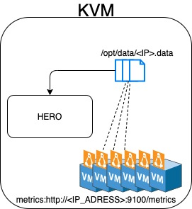

## Name convention
- Methods start with lower case and then upper case for each word: `useThis()`
- Write variables in lower case and use '_' : `*this_var*`

## Work convention
- The general configuration data is saved in a local file and imported (or read) when HERO starts running.
- Consider seriously before hard-coding anything - should this be in the configuration file?
                                                    Would anybody want to change that ever?

- When adding new tests the dataAccess.loadOn and dataAccess.loader method should be changed to fit the new data.
- A new `'key'` should be created, and the data taken from the file to the `'value'` and then added to the `"stats"` dictionary.
- A new weight should be added in mainSpine and configuration.py.

## Results
- Result file: for now, the program will only print the zombies and not write them to a file

## Architecture 
 

